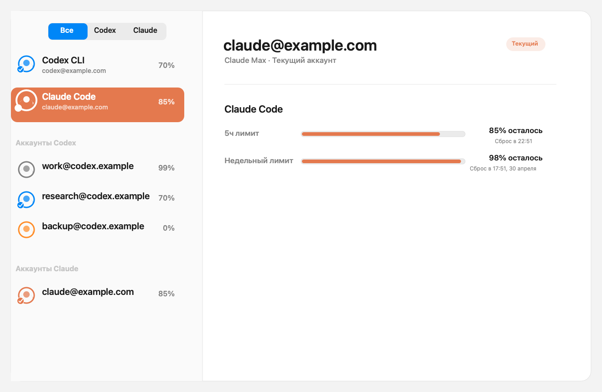
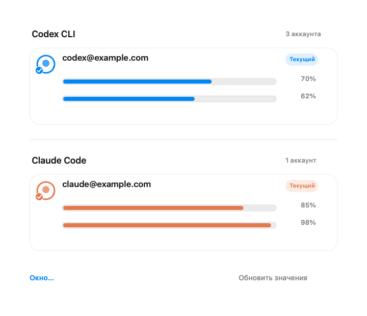

# Limits

Native macOS tray app for people who switch between several **Codex CLI** and **Claude Code** accounts and want to see remaining limits at a glance.

Limits keeps the important thing close: current account, remaining 5-hour limit, weekly limit, and quick switching between saved accounts.

<p align="center">
  
</p>

<p align="center">
  
</p>

> Screenshots use fake `example.com` accounts. They are generated demo images, not Amir's local data.

## What it does

- Shows Codex CLI limits in the menu bar panel and native macOS window.
- Shows Claude Code live limits when the Claude statusline bridge is enabled.
- Saves separate Codex and Claude accounts for quick switching.
- Highlights providers consistently: Codex is blue, Claude is coral.
- Stores saved auth snapshots in macOS Keychain.

## Install

Download the latest macOS build from **Releases**:

<https://github.com/AmirTlinov/Limits/releases/latest>

Unzip `Limits-...-macOS-arm64.zip`, move `Limits.app` to `/Applications`, then open it.

The current release is ad-hoc signed, not Apple-notarized. On first launch macOS may ask for confirmation in **System Settings → Privacy & Security**.

## Notes

- Codex support works through the local Codex CLI auth file and official CLI account/limit surfaces.
- Claude Code supports account switching through Keychain credentials and reads live limits only from Claude Code statusline data.
- The app does not invent Claude limits when Claude Code does not provide them.

## Build locally

```bash
swift test
./script/package_release.sh 0.1.0
```

The packaged app and zip are written to `dist/`.
