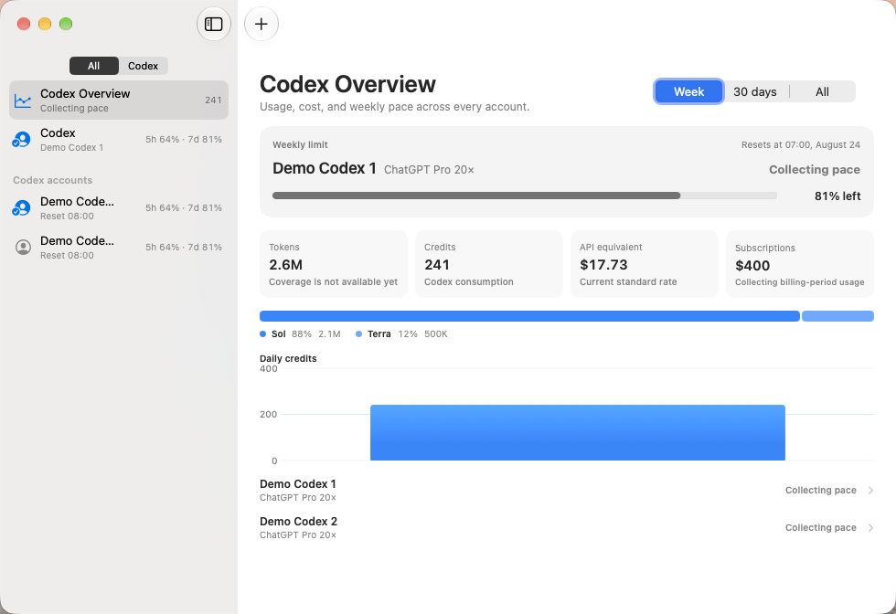
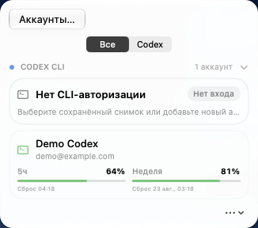

<p align="center">
  
</p>

<h2 align="center">Your Codex and Claude Code limits, in one native view</h2>

<p align="center">
  <a href="https://github.com/AmirTlinov/Limits/releases/latest">Releases</a> ·
  <a href="#installation">Installation</a> ·
  <a href="./PRIVACY.md">Privacy</a> ·
  <a href="./SECURITY.md">Security</a> ·
  <a href="./CONTRIBUTING.md">Contribute</a>
</p>

<p align="center">
  
</p>

<p align="center"><sub>The screenshots use synthetic accounts inside an isolated test fixture.</sub></p>

<br />

# Why Limits

One AI coding account is easy to watch. Several accounts are not. Each account has its own reset clock, subscription, usage history, and active credential, so the important answer gets scattered across tools: **which account is closest to its limit, and will it last until reset?**

Limits is a native macOS app that puts that answer in one place. It combines current Codex and Claude Code limits with real Codex usage, keeps the evidence fresh, and makes saved accounts available without turning credential files into a manual workflow.

<br />

# Installation

Limits requires an Apple-silicon Mac running macOS 26 or newer.

Download the macOS arm64 zip and its `.sha256` file from the [latest release](https://github.com/AmirTlinov/Limits/releases/latest), then verify the archive before opening it:

```bash
shasum -a 256 -c ./*.zip.sha256
```

Unzip the archive, move `Limits.app` to `/Applications`, and open it. Add the **Limits** widget from the macOS widget gallery if you also want current limits on the desktop or in Notification Center.

> The latest public release is Developer ID signed but predates the repository's notarization gate. macOS may ask for manual approval, and Widget Gallery may decline to index that historical build. The current release pipeline requires notarization and a stapled ticket before publishing a new build.

<br />

# Everything you need

Limits turns account state, quota windows, and local usage evidence into one consistent picture instead of another collection of counters.

<table>
  <tr>
    <td width="50%" valign="top">
      <h3>One overview</h3>
      See every saved account, yearly token activity, totals, model mix, trend, projects, and tasks under one selected period.
    </td>
    <td width="50%" valign="top">
      <h3>Reset-aware forecasts</h3>
      Distinguish “runs out before reset”, “lasts until reset”, “collecting pace”, and stale evidence from observed limits.
    </td>
  </tr>
  <tr>
    <td width="50%" valign="top">
      <h3>Actual Codex usage</h3>
      Track tokens, Codex credits, subscription cost, and the current API-price equivalent without presenting the comparison as an API bill.
    </td>
    <td width="50%" valign="top">
      <h3>Work breakdown</h3>
      Explain where local Codex usage went by model, project, and task while keeping full prompts, responses, and source files out of the database.
    </td>
  </tr>
  <tr>
    <td width="50%" valign="top">
      <h3>Safe account switching</h3>
      Save Codex and Claude Code accounts in macOS Keychain, validate a replacement identity, and restore the previous credential when switching fails.
    </td>
    <td width="50%" valign="top">
      <h3>Native surfaces</h3>
      Use the full app, the menu bar panel, or sandboxed WidgetKit widgets. Every surface reads the same account and freshness rules.
    </td>
  </tr>
</table>

<p align="center">
  
</p>

<p align="center"><strong>Current limits stay one click away in the menu bar.</strong></p>

<br />

# Local by design

Limits has no developer analytics, advertising SDK, account service, or crash-reporting service. Saved credentials live in macOS Keychain. Account state and extracted usage stay in the user's Application Support directory.

For Codex analytics, Limits imports numeric usage and bounded work metadata from local JSONL files. It does not store full prompts, responses, transcripts, source files, or project contents. The sandboxed widget receives only the small display snapshot it needs and never reads credentials or rollout files.

The complete data and network contract lives in [`PRIVACY.md`](PRIVACY.md). Sensitive security reports use GitHub's private path described in [`SECURITY.md`](SECURITY.md).

<br />

# Build from source

Install Xcode 26.4.1 or a compatible newer Xcode and the pinned project generator:

```bash
gem install xcodeproj -v 1.27.0 --no-document --user-install
./script/ci_gate.sh
./script/build_and_run.sh
```

The local gate regenerates the Xcode project, builds the app, runs every hostless test, and verifies the bundle without launching UI automation. GitHub Actions owns UI and lifecycle tests in a dedicated macOS session, so the test suite does not take over the developer's keyboard, pointer, windows, or menu bar.

Focused model and persistence checks use the hostless `LimitsUnitTests` scheme. The full architecture, contribution contract, and maintainer release path live in [`AGENTS.md`](AGENTS.md), [`CONTRIBUTING.md`](CONTRIBUTING.md), and [`docs/RELEASING.md`](docs/RELEASING.md).

<br />

# Stack

- Swift 6 with SwiftUI and AppKit
- WidgetKit with a sandboxed App Group snapshot
- SQLite for local usage history
- macOS Keychain for saved credentials
- Sparkle 2 with an EdDSA-signed update feed
- XCTest and Swift Testing under Xcode 26.4.1

<br />

# Contributing

Focused bug fixes and product improvements are welcome. Start with an issue when a change affects credential handling, persisted data, the update channel, or a visible product contract, then follow [`CONTRIBUTING.md`](CONTRIBUTING.md).

<br />

# License

Limits is available under the [MIT License](LICENSE). Embedded dependency notices are listed in [`THIRD_PARTY_NOTICES.md`](THIRD_PARTY_NOTICES.md).

Limits is an independent project and is not affiliated with, sponsored by, or endorsed by OpenAI or Anthropic. OpenAI, ChatGPT, Codex, Anthropic, and Claude are trademarks of their respective owners.
